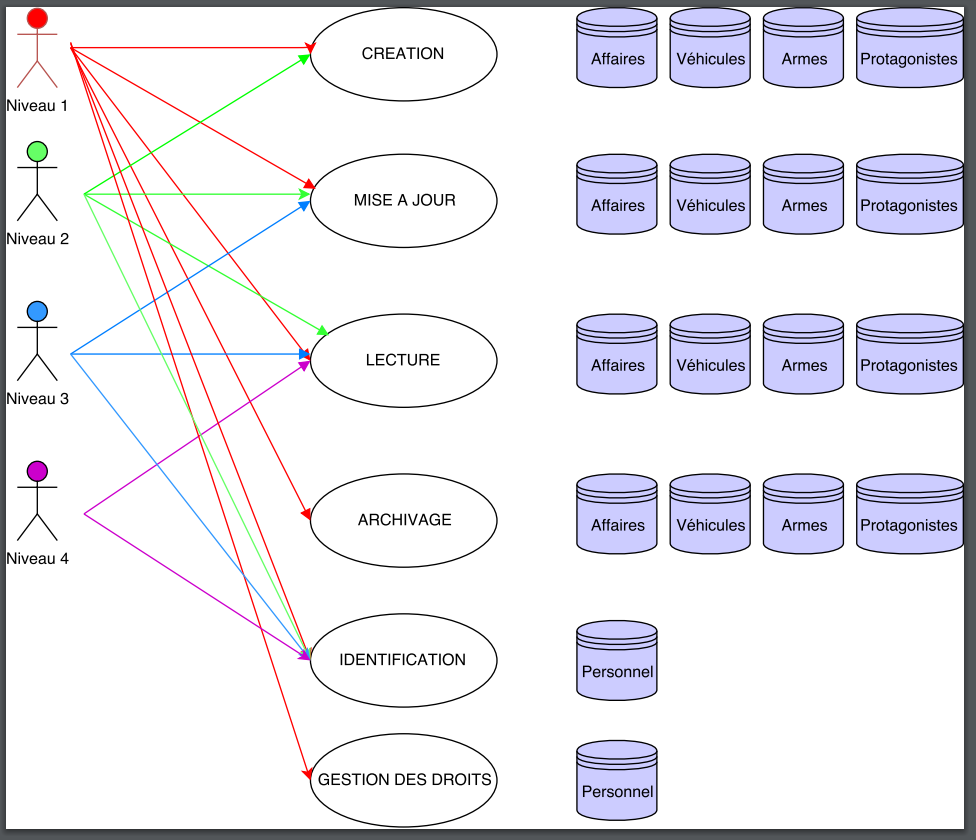
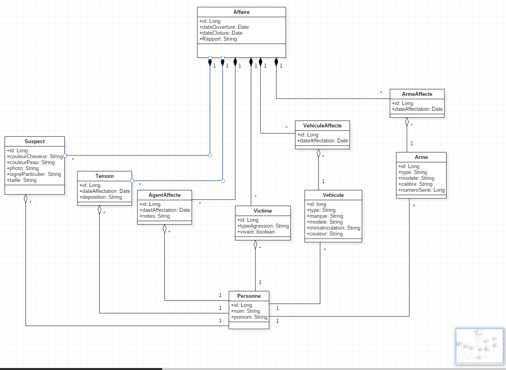
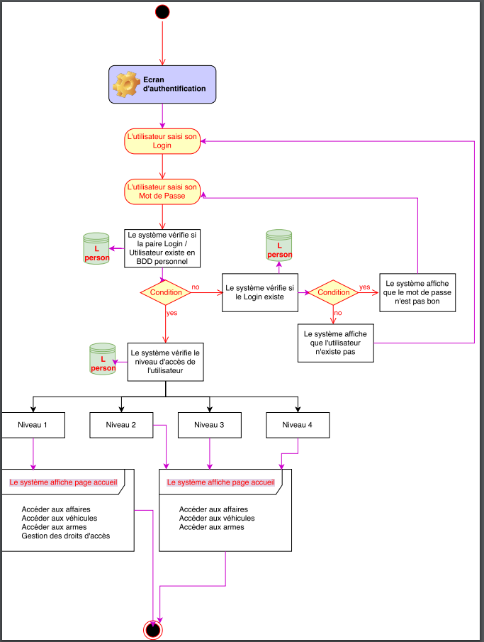
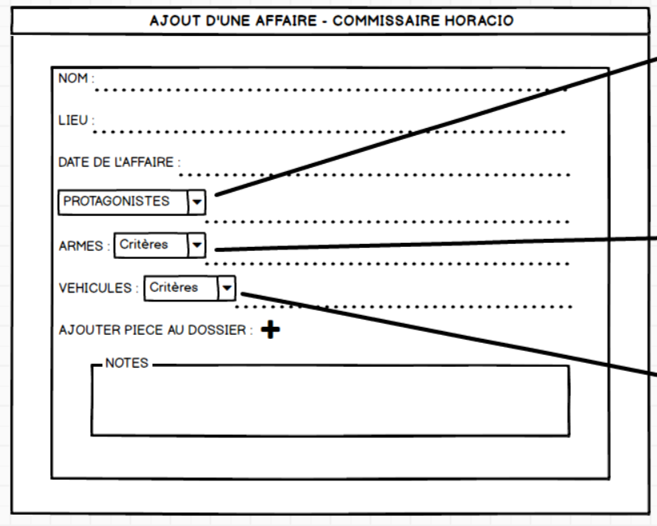

 # Evaluation CRUD
## MODE OPÉRATOIRE

### Prérequis (Back)
- Java 1,8
- DatabaseCREATE.sql (création de la base)
- DatabaseTable.sql (création des tables et ajouts données) [lien fichier DatabaseTable](https://github.com/nwardez/CRUD-BACK/blob/master/src/main/resources/databaseTable.sql)
- Ces fichiers se trouvent dans src/main/resources

#### Modifications nécessaires [Lien fichier properties](https://github.com/nwardez/CRUD-BACK/blob/master/src/main/resources/application.properties)
- spring.datasource.username= Votre username SQL
- spring.datasource.password= Password SQL

- Si besoin de changer le port du serveur Tomcat,  ajouter la ligne : 
server.port: XXXX

### Lancement

#### Back
Via GitHub :
1. Cloner le repo
2. Ajouter le projet à votre IDE préférée
3. Faire un ```MVN Clean Install```
4. Faire un Maven Update Project
5. Lancer l’application via : Run as Spring Boot App

## DIAGRAMMES

### USECASE



### DIAGRAMME DE CLASSE




### DIAGRAMMES D’ACTIVITE



## Technologies Back
Sous éclipse: 
  -programme en JAVA Spring Boot et ustilisation de JPA Hibernate pour créer les tables et ses relations 
   dans la base de données.
  
## Evaluation des compétences
### Structure du projet

Réalisation du programme: 
  - Toutes les classes (model) de A à Z  ainsi que leur controller en passant par l'interface JPArepository
    organisé par [packages](https://github.com/nwardez/CRUD-back/tree/master/src/main/java/co/simplon).
      

## INSTALLATION
### Création d'une base de données vide
Via la lignes de commande SQL:
```
CREATE DATABASE gedesaft_v2;
```

### SCHEMA SQL


### Récupération du projet

### Ouvrir le projet dans éclipse
Changer le mot de passe existant avec le votre dans l'application properties
sur la ligne suivante: 
```
spring.datasource.password=
```
En lançant l'application (run as Application java), la connexion au port:8080 s'initialise,
il vous est donc possible de tester ce programme via POSTMAN.

##TEST UNITAIRE
Un test fonctionnel a été créé à cette adresse: [lien test](https://github.com/nwardez/CRUD-back/blob/master/src/test/java/com/example/demo/AffaireRepositoryTest.java)
 
 ##MOCKUP
 
Une partie du Mockup réalisé avec Balsamicq :
        
  